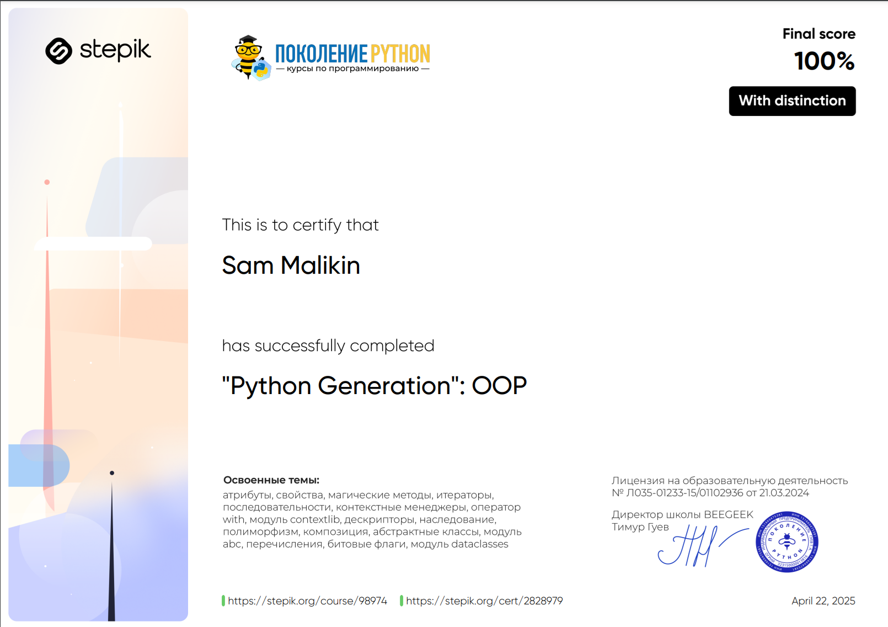

# Python Generation: OOP Course 📚

## Description 📝

Welcome to the **Python Generation: OOP Course**!  
This course is a continuation of the **Python Generation** series, including courses for beginners, advanced users, and professionals, designed for those who want to master **Object-Oriented Programming (OOP)** with `Python`.  
I will explore key OOP concepts, including attributes, properties, methods, inheritance, polymorphism, protocols, and advanced features like `enum`, `dataclasses`, and class decorators.

By the end of this course, I will have developed professional `Python OOP` programming skills and be capable of designing and implementing robust, modular, and reusable code for real-world applications.

The course includes **231 practical programming tasks** and **552 theoretical questions**, ensuring hands-on experience and a deep understanding of each topic.

Upon successful completion, I will receive a **certificate of completion** , validating my expertise in `Python OOP` programming.

## Purpose 🎯

The course aims to:

-   Strengthen my knowledge of `Python`’s OOP principles and best practices.
-   Introduce core OOP concepts such as attributes, properties, methods, inheritance, and polymorphism.
-   Teach me how to work with advanced features like `enum`, `dataclasses`, and class decorators.
-   Help me master protocols, magic methods, and advanced class design techniques.
-   Provide practical problem-solving skills through challenging tasks and assessments.
-   Prepare me for real-world `Python` applications and further professional development in OOP.

## Course Structure 📋

The course is divided into the following sections:

1. **Course Introduction** 📘

    - Overview of the course content and introduction to `Python OOP` concepts.

2. **Reviewing Basic Python Constructs** 🔄

    - Revisiting essential Python constructs like loops, conditionals, decorators, and functions through practical tasks.

3. **Introduction to OOP** 📘

    - Learning the fundamentals of OOP, including encapsulation, inheritance, polymorphism, and abstraction, and comparing OOP with procedural programming.

4. **Attributes, Properties, and Methods** 🧠

    - Understanding object and class attributes, instance/class/static methods, access modifiers, and property decorators for clean code.

5. **Magic Methods** ✨

    - Mastering magic methods to customize object behavior, including operator overloading, type conversions, and hashing.

6. **Protocols** 🛠️

    - Implementing protocols like iterable, sequence, context manager, and descriptor protocols for flexible and reusable classes.

7. **Inheritance and Polymorphism** 🧬

    - Exploring inheritance, polymorphism, abstract classes, multiple inheritance, and composition for advanced class hierarchies.

8. **Additional Features** ⚙️

    - Learning advanced features like slots, data classes, enumerations, bit flags, and mixins for efficient and modular code.

9. **Class Design Tasks** 🏆

    - Applying OOP principles to solve complex, real-world problems through practical programming tasks.

## Key Features ✨

-   **231 practical tasks** to reinforce learning.
-   **552 theoretical questions** to test comprehension.
-   **Certificate of Completion** available upon finishing the course.
-   Covers essential and advanced `Python OOP` topics for real-world applications.
-   Provides a strong foundation for professional growth in `Python` programming.

## Conclusion 🚀

By completing this course, I will have gained advanced `Python OOP` skills that will enable me to design and implement complex, modular, and reusable code for real-world applications.  
With hands-on practice, theoretical knowledge, and a structured approach, this course is the perfect next step to becoming an expert `Python` engineer specializing in object-oriented programming.
