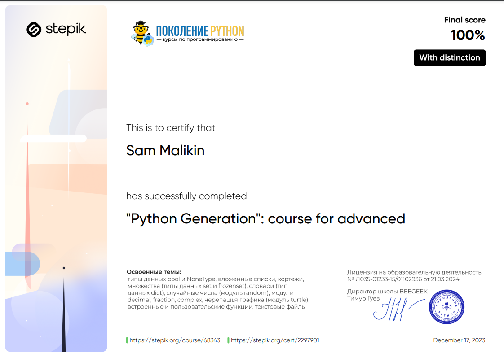

# Python Generation: Advanced Course 📚

## Description 📝

Welcome to the **Python Generation: Advanced Course**!  
This course is designed for those who have already mastered the basics of Python and want to dive deeper into advanced topics.
It covers complex data structures, functional programming, file handling, and more.

By the end of this course, I will have a thorough understanding of Python’s advanced features and be capable of writing efficient and scalable code.

The course includes **324 practical programming tasks** and **456 theoretical questions**, ensuring hands-on experience with real-world applications.

Upon successful completion, I will receive a **certificate of completion**  , validating my expertise in Python programming.

## Purpose 🎯

The course aims to:

-   Strengthen my knowledge of Python's core features and best practices.
-   Introduce advanced concepts such as nested lists, tuples, sets, and dictionaries.
-   Teach me how to work with files, modules, and functions efficiently.
-   Provide practical problem-solving skills through challenging tasks and assessments.
-   Prepare me for real-world Python applications and further professional development.

## Course Structure 📋

The course is divided into the following sections:

1. **General Course Info** 📖

    - Introduction to the course structure and expectations.

2. **Revisiting Basic Python Constructs** 🔄

    - Refreshes knowledge of essential Python syntax and logic.

3. **Boolean and NoneType Data Types** 🧑‍💻

    - Understanding Boolean logic and the `NoneType` data type.

4. **Nested Lists and Matrices** 🧮

    - Working with multi-dimensional lists and matrix operations.

5. **Nested Lists and Matrices Final Test** 🎯

    - A comprehensive assessment covering nested lists and matrices.

6. **Tuples** 🎭

    - Exploring immutable sequences and their applications.

7. **Tuples Final Test** 📚

    - A theoretical and practical test on tuple concepts.

8. **Sets** 🔢

    - Understanding set theory and its implementation in Python.

9. **Sets Final Test** 🏁

    - Theoretical and hands-on assessments on sets.

10. **Dictionaries** 🗂️

    - Exploring key-value pairs and their efficient use in Python.

11. **Dictionaries Final Test** 📚

    - 9 practical tasks and 13 theoretical questions.

12. **Random and String Modules** 🎲📜

    - Working with randomness, sequences, and Monte Carlo simulations.

13. **Decimal, Fraction, and Complex Modules** 📚

    - Handling precise arithmetic with rational and complex numbers.

14. **Turtle Module** 🐢

    - Learning graphical programming with Python’s `turtle` module.

15. **Functions** 🔍

    - Advanced function concepts, including higher-order functions.

16. **Functions Final Test** 📝

    - 3 lessons and 13 practical tasks to assess function knowledge.

17. **File Handling** 📂

    - Reading, writing, and manipulating text files efficiently.

18. **File Handling Final Test** 🏆
    - 8 practical tasks focusing on file operations.

## Key Features ✨

-   **324 practical tasks** to reinforce learning.
-   **456 theoretical questions** to test comprehension.
-   **Certificate of Completion** available upon finishing the course.
-   Covers essential Python topics for real-world applications.
-   Provides a strong foundation for professional growth in Python.

## Conclusion 🚀

By completing this course, I will have mastered advanced Python programming concepts, preparing me for complex real-world applications and further professional development.  
With a combination of hands-on practice, theoretical knowledge, and a structured approach, this course is my next step toward becoming an expert Python developer.
