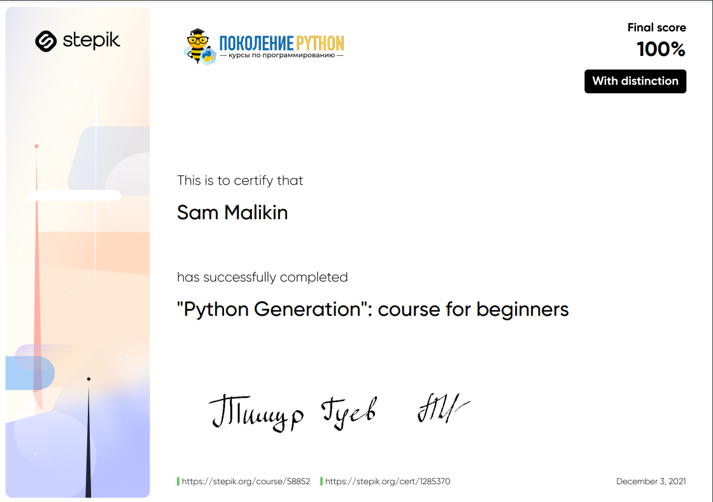

# Python Generation: Beginner Course 📚

## Description 📝

Welcome to the **Python Generation: Beginner Course**!
This course is the first in the Python Generation series and serves as an excellent starting point for anyone looking to dive into the world of Python programming.
By the end of this course, I'll have a solid foundation in Python, equipped with essential skills like input/output handling, decision-making structures, loops, strings, lists, and functions.

The course is filled with **310 practical programming tasks**, theoretical questions, and several projects, allowing me to reinforce each concept.
The course is recognized worldwide and has over **1 million students**. It is a proud winner of the **Stepik Awards 2020** in the category of "Best Free Online Course".

This course not only provides a strong foundation in Python but also offers a **certificate of completion**  , which can be used to participate in the "Talent 20.35" competition.

## Purpose 🎯

The course aims to:

-   Introduce beginners to Python programming.
-   Teach essential programming concepts, including data types, conditional statements, loops, strings, and functions.
-   Equip learners with practical problem-solving skills through hands-on tasks and projects.
-   Provide a pathway to more advanced Python courses.

## Course Structure 📋

The course is divided into the following sections:

1. **2_input_output**
    - Learn how to print data, receive input from users, and handle basic arithmetic operations.
2. **3_io_final_tests**

    - Final test to assess your understanding of input/output operations and data handling.

3. **4_conditional_operator**

    - Master conditional operators (`if-elif-else`) to make decisions in your code.

4. **5_conditional_operator_final_tests**

    - A series of tasks to test your ability to use decision-making structures in various scenarios.

5. **6_data_types**

    - Understand the basic data types in Python (e.g., integers, floats) and how to manipulate them.

6. **7_loops**

    - Learn how to use `for` and `while` loops for iteration, and explore control mechanisms like `break`, `continue`, and `else`.

7. **8_loops_final_tests**

    - Includes theoretical questions and practical tasks related to loops to ensure mastery.

8. **9_string_data_type**

    - Dive into string operations: indexing, slicing, and string methods for text manipulation.

9. **10_string_final_tests**

    - Assess your knowledge of string manipulation with theoretical and practical tasks.

10. **11_lists**

    - Learn how to work with lists, including list operations, list comprehensions, and sorting algorithms.

11. **12_lists_final_tests**

    - Hands-on practice tasks focusing on lists, including generating and transforming data.

12. **13_functions**

    - Master functions, from basic to advanced topics like return values, parameters, and scope.

13. **14_functions_final_tests**
    - Final tests that focus on applying functions to solve practical problems.

## Key Features ✨

-   **310 practical tasks** to help me practice what I've learned.
-   **Projects** that consolidate my learning and showcase my skills.
-   **Certificate of Completion** available upon finishing the course, which can be used to participate in the **"Talent 20.35" competition**.
-   Recognized by **educators** from top universities like **HSE**, **SPbSU**, **MAI**, and **MIREA**.

## Conclusion 🚀

By completing this course, I'll have a strong understanding of Python basics and be prepared to tackle more advanced topics in Python programming.
With hands-on practice, real-world examples, and a focus on practical problem-solving, this course is my stepping stone to becoming a proficient Python developer.
