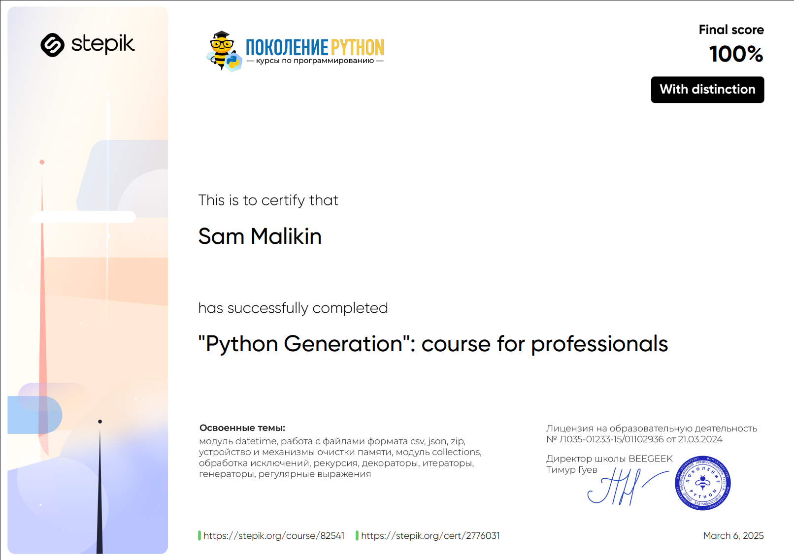

# Python Generation: Course for Professionals 📚

## Description 📝

Welcome to the **Python Generation: Course for Professionals**!  
This course is a continuation of the **Python Generation** courses for beginners and advanced users, designed for those who want to deepen their knowledge of Python.  
I will explore a range of important topics, including advanced data types, working with dates and times, file handling, recursion, exception handling, and much more.

By the end of this course, I will have mastered professional Python programming skills and be capable of solving complex real-world problems with Python.

The course includes **394 practical programming tasks** and **798 theoretical questions**, ensuring that I gain hands-on experience and a thorough understanding of each topic.

Upon successful completion, I will receive a **certificate of completion** , validating my expertise in Python programming.

## Purpose 🎯

The course aims to:

-   Strengthen my knowledge of `Python`'s core features and best practices.
-   Introduce advanced concepts such as working with dates, times, file formats (`JSON`, `CSV`, `ZIP`), and memory management.
-   Teach me how to efficiently handle errors and exceptions in `Python` code.
-   Help me master recursion, regular expressions, and advanced collection types.
-   Provide practical problem-solving skills through challenging tasks and assessments.
-   Prepare me for real-world `Python` applications and further professional development.

## Course Structure 📋

The course is divided into the following sections:

1. **Course Introduction** 📝

    - Overview of the course content and key topics.

2. **Reviewing Basic Python Constructs** 🔄

    - Revisiting Python’s basic syntax and core programming concepts.

3. **Working with Dates and Times** 🕒

    - Handling `date` and `time` data types, time zones, and performance measurements.

4. **File Handling** 📂

    - Working with different file formats like `CSV`, `JSON`, and `ZIP`, and managing file I/O.

5. **Memory Structure and Features of Data Types** 🧠

    - Understanding `Python’s` memory management, mutable vs. immutable types, and memory optimization techniques.

6. **Additional Collection Types** 🧳

    - Working with advanced collections like `namedtuple`, `defaultdict`, and `OrderedDict`.

7. **Exception Handling** ⚠️

    - Learning how to manage errors and exceptions in `Python` to build robust applications.

8. **Recursion** 🔁

    - Mastering recursion for solving complex problems using self-referential functions.

9. **Functions** 🔍

    - Deep dive into `Python` functions, decorators, and function objects.

10. **Iterators and Generators** 🔄

    - Understanding the concepts of iterators and generators for memory-efficient programming.

11. **Regular Expressions** 🔍

    - Learning how to use regular expressions for pattern matching and text manipulation.

12. **Conclusion** 🎯

    - Wrapping up the course with key takeaways and next steps for further growth.

## Key Features ✨

-   **394 practical tasks** to reinforce learning.
-   **798 theoretical questions** to test comprehension.
-   **Certificate of Completion** available upon finishing the course.
-   Covers essential and advanced `Python` topics for real-world applications.
-   Provides a strong foundation for professional growth in `Python`.

## Conclusion 🚀

By completing this course, I will have gained advanced `Python` skills that will allow me to handle complex projects and real-world applications effectively.  
With hands-on practice, theoretical knowledge, and a structured approach, this course is the perfect next step to becoming an expert `Python` engineer.
